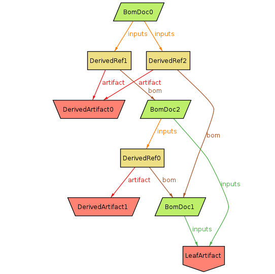

# Alloy model for [gitbom](https://gitbom.dev)

I've been trying to use [Alloy](https://alloytools.org) to [specify
gitbom](gitbom.als). This is mostly for my own understanding, but it's also
useful for shaking out any imprecision.

I'm basing this off the glossary pages:
- [artifact](https://gitbom.dev/glossary/artifact/)
- [artifact tree](https://gitbom.dev/glossary/artifact_tree/)
- [GitBOM](https://gitbom.dev/glossary/gitbom/)

and it's intended to reflect the current design.

## Simplified spec - implicit OIDs

The [simplified spec](gitbom-no-oid.als) has objects directly reference each
other. In this model, OIDs are implicit. That is, we're just assuming that every
addressible object has a distinct OID, but we don't care at all about what form
they take.

The meta-model is as follows:
- Two types of [`Artifact`](https://gitbom.dev/glossary/artifact/) which
  represents a chunk of bytes. They're divided into two subtypes (though
  somewhat arbitrarily - [see below](#derivedartifact-and-leafartifact-are-not-distinct)):
  - [`LeafArtifact`](https://gitbom.dev/glossary/artifact/#leaf-artifacts) which is typically human-written or at least external to this build process.
  - [`DerivedArtifact`](https://gitbom.dev/glossary/artifact/#derived-artifacts) which is generated by some build step.
- [`BomDoc`](https://gitbom.dev/glossary/gitbom/#gitbom-document) (aka "GitBOM Document"), which is a set of references to inputs. `LeafArtifacts` can be referenced directly.
  - `DerivedRef` mediates references to `DerivedArtifacts`, because they're also tied to the `BomDoc` for the build step which generated it.

An example instance of this model:

## Spec with OIDs

The [more detailed spec](gitbom-oid.als) explicitly includes OIDs. This is
closer to the real system, but the OIDs add a lot of extra complexity.  However,
once we start to consider how to handle constructing OIDs with multiple hash
functions, we'll need the explicit representation.

TODO: This is pretty rough - most of my focus has been on the implicit OID
version.

With an example instance:

# Observations

This is just a snapshot of my understanding of the writeup on gitbom.dev &mdash;
I could easily have got things wrong. Some misc things I noticed.

## GitBOM documents only encode inputs

GitBOM documents (BomDocs) only encode input artifacts. But they do not encode
what build action was actually taken, nor what outputs were generated. So two
different build actions producing different derived output artifacts would
reference the same BomDoc.

Related to this, there's no real way of distinguishing how many actions were
run, or what outputs they had, except by looking for all the derived
artifact+bom references (`DerivedRef` here) which exist in the graph.

I think this means that the BomDoc needs to either encode - as part of its
identity - either what the build action was, or what the output artifacts were.
Since the output artifacts are more important as far as determining provenance
is concerned, they're probably preferable. (Unless you can guarantee
deterministic output from tools, the build action on its own is not enough
anyway.)

## Derived artifacts

One not immediately obvious constraint was that a BomDoc cannot depend on a
given derived artifact and another BomDoc which also depends on that derived
artifact (this is a stronger constraint than acyclic BomDoc graph). For example, here `BomDoc0` depends on `DerivedArtifact` which was apparently generated by `BomDoc2`, but `BomDoc1` also depends on `DerivedArtifact` *and* `BomDoc0`:

(Though actually, since `DerivedArtifact` just represents a pattern of bits,
there's no particular reason why `BomDoc2` and `BomDoc0` couldn't both
independently generate the same bits, even if they have a dependency
relationship. So maybe the real constraint is just that the `BomDoc`s themselves
can't be cyclic.)

Also here's an example of a BomDoc depending on a derived artifact twice,
generated by two different build actions. Presumably this is a case where two
actions ended up producing identical outputs, and a third action ends up depending on both.

One way this could arise is if `DerivedArtifact0` were actually something simple
like an empty file - it's easy to imagine two separate actions both emitting
that. But of course there are also possibilities where it could be a non-trivial
file.

## `DerivedArtifact` and `LeafArtifact` are not distinct

Since artifacts are entirely defined by their content, a given set of bytes can
be both derived and a leaf if they happen to have the same content. This spec
keeps the distinction for clarity, but it might actually be misleading. It would
be strictly more accurate to use plain `Artifact` everywhere.

## Misc
- I assume a GitBOM document must have at least one input (and one output if
  we're also recording those).

# Appendix - About Alloy

Alloy is a formal specification and validation tool. It allows you to specify a
system by describing entities, and the relationships between them with various
constraints. It is a high-level and somewhat abstract tool, which means that the
specifications tend to be quite terse compared to a conventional programming
language.

The most basic way of using the tool is to define a spec and have it generate
random instances of that spec which it displays graphically (all the diagrams in
this doc are directly from Alloy's GUI). I find it extremely useful to just keep
doing this to get an intuition about the structure, and use it to refine the
spec ("Oh, that shouldn't be happening...").

More advanced uses include defining invariants (ie things you believe ought to
be always true given the spec) and have Alloy try to find counter-examples. And
you can also use it to model mutations to a structure to make sure the
invariants are maintained over abitrary sequences of operations.

Resources:
- [Main site](https://alloytools.org)
  - [Book](https://alloytools.org/book.html)
- [Releases](https://github.com/AlloyTools/org.alloytools.alloy/releases)
- [Useful third-party documentation](https://alloy.readthedocs.io/en/latest/)

I found the book to be pretty good, though it's a little out of date with
respect to the current release (but all the fundamentals are still important and
useful). The third-party docs by [Hillel Wayne](https://www.hillelwayne.com/)
are up to date and very useful reference.
