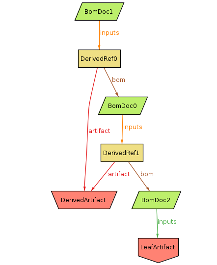

# Alloy model for [gitbom](https://gitbom.dev)

I've been trying to use [Alloy](https://alloytools.org) to [specify gitbom](gitbom.als). This is mostly for my own understanding, but it's also useful for shaking out any imprecision.

The [simplified spec](gitbom-no-oid.als) has objects directly reference each other.
In this model, OIDs are implicit.

The meta-model is as follows:
- Two types of [`Artifact`](https://gitbom.dev/glossary/artifact/):
  - [`LeafArtifact`](https://gitbom.dev/glossary/artifact/#leaf-artifacts) which is typically human-written.
  - [`DerivedArtifact`](https://gitbom.dev/glossary/artifact/#derived-artifacts) which is generated by some build step.
- [`BomDoc`](https://gitbom.dev/glossary/gitbom/#gitbom-document) (aka "GitBOM Document"), which is a set of references to inputs. `LeafArtifacts` can be referenced directly.
  - `DerivedRef` mediates references to `DerivedArtifacts`, because they're also tied to the `BomDoc` for the build step which generated it.

An example instance of this model:

## OID spec

The [more detailed spec](gitbom-oid.als) explicitly includes OIDs. This is closer to the real system, but the OIDs add a lot of extra complexity.

With an example instance:

# Observations

This is just a snapshot of my understanding of the writeup
on gitbom.dev &mdash; I could easily have got things wrong.
Some misc things I noticed:
- GitBOM documents (BomDocs) only encode input artifacts. But they do not encode what build action was actually taken, nor what outputs were generated. So two different build actions producing different derived output artifacts would reference the same BomDoc.
  - I think this is a case where thinking of it as a tree, and the references to parent/child relationships, is actively misleading by setting the wrong mental model.
- Related to this, there's no real way of distinguishing how many actions were run, or what outputs they had, except by looking for all the derived artifact+bom references (`DerivedRef` here) which exist in the graph.
- I assume a GitBOM document must have at least one input.
- One not immediately obvious constraint was that a BomDoc cannot depend on a given derived artifact and another BomDoc which also depends on that derived artifact (which is subtle and distinct from a cycle in the BomDoc graph, which also can't happen). For example:

