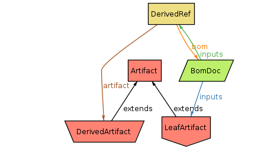
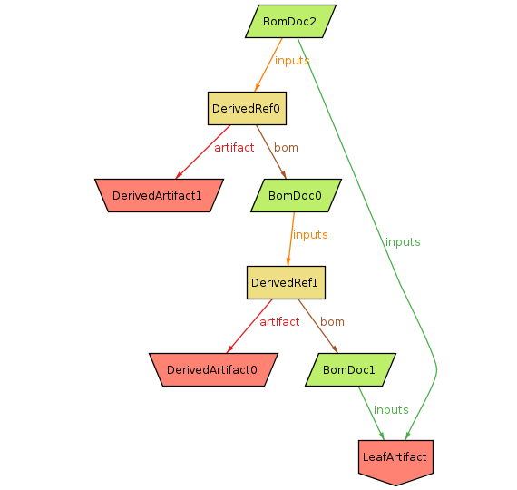
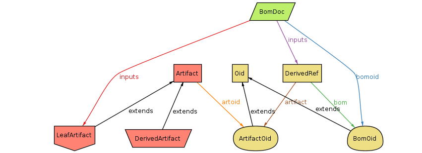
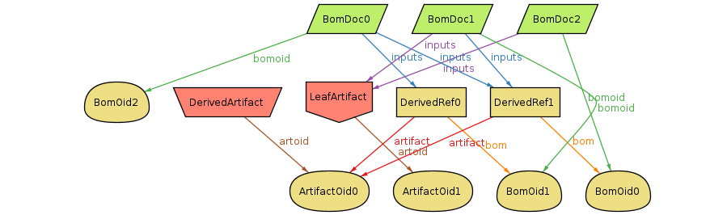

# Alloy model for [gitbom](https://gitbom.dev)

I've been trying to use [Alloy](https://alloytools.org) to [specify gitbom](gitbom.als). This is mostly for my own understanding, but it's also useful for shaking out any imprecision.

The [simplified spec](gitbom-no-oid.als) has objects directly reference each other.
In this model, OIDs are implicit.

The meta-model is as follows:
- Two types of `Artifact`:
  - `LeafArtifact` which is typically human-written.
  - `DerivedArtifact` which is generated by some build step.
- `BomDoc`, which is a set of references to inputs. `LeafArtifacts` can be referenced directly.
  - `DerivedRef` mediates references to `DerivedArtifacts`, because they're also tied to the `BomDoc` for the build step which generated it.

An example instance of this model:

## OID spec

The [more detailed spec](gitbom-oid.als) explicitly includes OIDs. This is closer to the real system, but the OIDs add a lot of extra complexity.

With an example instance:

