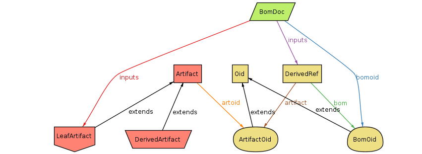

# Alloy model for [gitbom](https://gitbom.dev)

I've been trying to use [Alloy](https://alloytools.org) to [specify gitbom](gitbom.als). This is mostly for my own understanding, but it's also useful for shaking out any imprecision.

